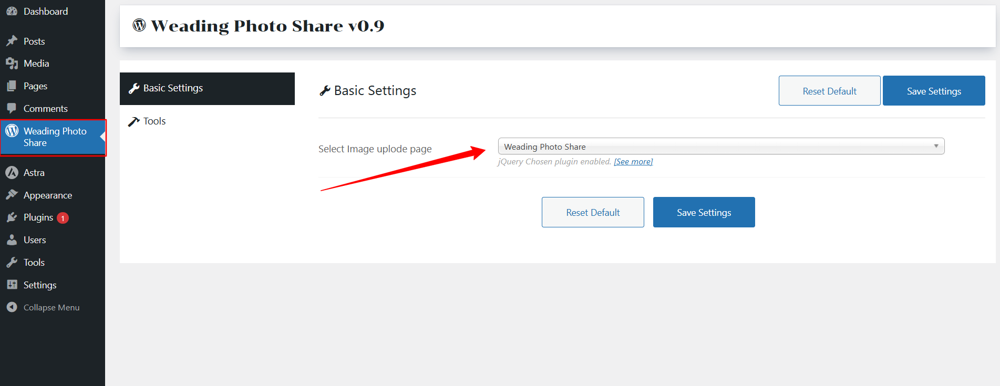
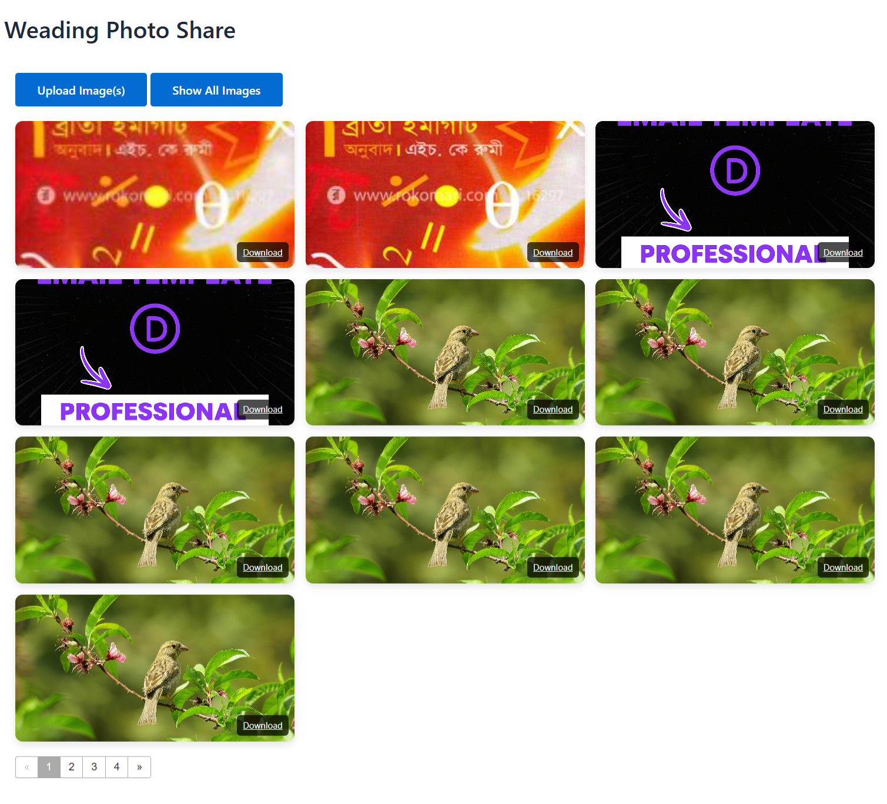

# 💍 Wedding Photo Share (WordPress Plugin) 📸  

A simple and joyful plugin that allows wedding guests to **upload photos** by scanning a QR code and to **download the gallery** later. Perfect for capturing memories in real time! 🎉  

## ✨ Features  
- 📱 **QR code link** (generate QR externally) that opens a portal page.  
- 🎯 Portal shows two actions: **Upload Photo(s)** ➕ **Download All Photos**.  
- 📤 Guests can upload **single or multiple** images (no login required).  
- 📂 Images are stored in `wp-content/uploads/wedding-photos/`.  
- 🖼️ Gallery displays uploaded images with **per-image download** links.  
- 📦 **Download All** creates a ZIP of every uploaded image.  

## 📥 Installation  
1. 📁 Upload the `wedding-photo-share` folder to your WordPress plugins directory (`/wp-content/plugins/`).  
2. ⚙️ Activate the plugin in the WordPress admin.  
3. 📝 Create a new Page and insert the shortcode `[image_uploader]` to show the **Upload** and **Show All Images** buttons.  
4. 📝 Create a new Page and insert the shortcode `[weading_qr]` to display the QR code.  
5. 🎟️ Generate a QR code pointing to the page URL you created and print it on cards for guests.  
6. ⚙️ From the plugin **Settings** page, select the page you added the `[image_uploader]` shortcode to.  

## 📸 Settings   

Select the page that you are add the `[image_uploader]` short code

The qr code after add the short code `[weading_qr]` 

The image uplode and show all image section `[weading_qr]` 

## 🔒 Notes & Security  
- ⚠️ This plugin allows **anonymous uploads** — consider adding a **secret token** or **moderation** step before events.  
- ✅ Allowed image types: **jpg, jpeg, png, gif, webp**.  
- 👀 For moderation, modify `wps_handle_upload` to store uploads in a **holding folder** and add an admin approval screen.  

## 📂 Files  
- 📜 `wedding-photo-share.php` — main plugin file  
- 🎨 `assets/css/style.css` — styles  
- 💻 `assets/js/upload.js` — JS for upload/gallery refresh  
- 📖 `readme.md` — this file  

## 📜 License  
MIT — ✏️ feel free to modify and publish on GitHub.  
